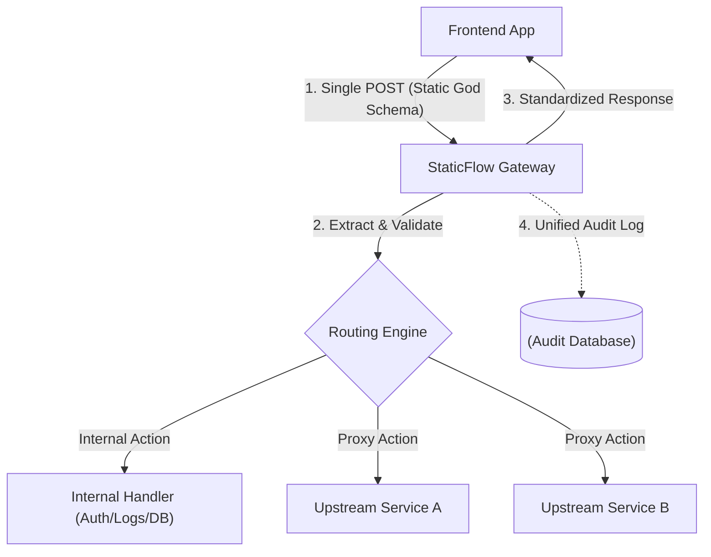

# StaticFlow 🚀

**The Unified API Gateway Framework for "God Schema" Architectures.**

`StaticFlow` is a lightweight, high-performance Python framework designed to simplify Backend-for-Frontend (BFF) development. It enables a **"Universal Gateway"** pattern where the frontend communicates via a single, static JSON contract (the "God Schema"), while the gateway handles routing, data extraction, and upstream proxying.

[](https://badge.fury.io/py/staticfloww)
[](https://opensource.org/licenses/MIT)

---

## 🌟 The Problem
In modern microservice or multi-API environments, frontend applications suffer from:
-   **Fragmented Requests**: Needing to hit multiple diverse endpoints for a single view.
-   **Breaking Contracts**: Any change in an upstream API requires a frontend update.
-   **Auth Complexity**: Managing different authentication flows for different services.
-   **Observability Gaps**: Difficulty tracking a single user action across multiple downstream calls.

## ✨ The Solution: StaticFlow
`StaticFlow` provides a unified proxy layer that "plucks" exactly what it needs from a static, massive payload (the God Schema) and forwards it to the correct upstream service. It turns your backend into a clean, predictable API for your frontend team.

---

## 🛠 Key Features

-   **🎯 The "God Schema" Engine**: Maintain one single Pydantic-based schema that never changes shape.
-   **🧬 Smart Extraction**: Automatically extract and validate data segments based on the request `action`.
-   **🔀 Parallel Fan-out**: Trigger multiple upstream requests in parallel (using `asyncio.TaskGroup`) and merge results into a single response.
-   **🛡 Resilience**: Built-in **Exponential Backoff Retries** and **Circuit Breaking** to prevent cascading failures.
-   **🔒 Flexible Auth**: Handle API Keys (Header/Body/Param), OAuth2 Client Credentials, or Passthrough with Bearer normalization.
-   **🔌 Unified Auditing**: Log entire request/response/error cycles as single atomic transactions to **MongoDB** or **In-Memory**.
-   **📜 Contract Generation**: Automatically export your Python schema to **TypeScript types** for your frontend team.
-   **🧪 Mocking Mode**: Return mock data for specific routes to unblock frontend development.

---

## 📐 Architecture



---

## 🚀 Quick Start

### 1. Install
```bash
pip install staticfloww
```

### 2. Define your Static Schema
```python
from staticfloww import StaticPayload, Section
from typing import Optional

class UserDetails(Section):
    first_name: str
    last_name: str

class MyGodSchema(StaticPayload):
    # Data Sections for specific requests
    UserDetails: Optional[UserDetails] = None
```

### 3. Configure the Gateway
```python
from staticfloww import Gateway, APIKeyHandler, MemoryAuditor

# Initialize with In-Memory Auditing
auditor = MemoryAuditor()
app = Gateway(base_url="https://api.your-backend.com", auditor=auditor)

app.add_route(
    action="CREATE_MEMBER",
    path="/api/members/register",
    method="POST",
    extract="UserDetails",
    auth=APIKeyHandler(key="your-secret-key", location="header")
)
```

### 4. Use in FastAPI
```python
from fastapi import FastAPI
from my_schema import MyGodSchema

web_app = FastAPI()

@web_app.post("/gateway")
async def handle_request(payload: MyGodSchema):
    return await app.route_request(payload)
```

---

## 📂 Project Structure
```text
staticfloww/
├── core/
│   ├── engine.py      # Orchestrator (TaskGroups & Semaphores)
│   ├── gateway.py     # Main Entry point
│   ├── proxy.py       # Httpx communication
│   ├── routing.py     # Route & Action mapping
│   ├── auth.py        # APIKey, OAuth2, Passthrough
│   └── resilience.py  # Retries & Circuit Breaker
├── middleware/
│   └── auditing.py    # Memory & MongoDB logging
├── schemas/
│   └── base.py        # StaticPayload & Section definitions
└── utils/
    └── ts_gen.py      # TypeScript Generator
```

---

## 🛣 Future Roadmap

-   **⏱ Rate Limiting**: Built-in protection to prevent gateway or upstream abuse.
-   **📊 Health Dashboard**: Real-time status of all upstream services and circuit states.
-   **🤖 AI Scaffolding Agent**: Automatically generate Pydantic schemas from Swagger/OpenAPI docs.

---

## 📄 License
MIT License. Created with ❤️ for clean API architectures.
