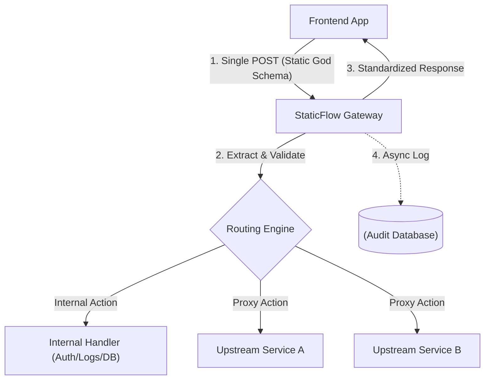

# StaticFlow 🚀

**The Unified API Gateway Framework for "God Schema" Architectures.**

`StaticFlow` is a lightweight, high-performance Python framework designed to simplify Backend-for-Frontend (BFF) development. It enables a **"Universal Gateway"** pattern where the frontend communicates via a single, static JSON contract (the "God Schema"), while the gateway handles routing, data extraction, and upstream proxying.

---

## 🌟 The Problem
In modern microservice or multi-API environments, frontend applications suffer from:
-   **Fragmented Requests**: Needing to hit multiple diverse endpoints for a single view.
-   **Breaking Contracts**: Any change in an upstream API requires a frontend update.
-   **Auth Complexity**: Managing different authentication flows for different services.
-   **Observability Gaps**: Difficulty tracking a single user action across multiple downstream calls.

## ✨ The Solution: StaticFlow
`StaticFlow` provides a unified proxy layer that "plucks" exactly what it needs from a static, massive payload (the God Schema) and forwards it to the correct upstream service.

---

## 🛠 Key Features

-   **🎯 The "God Schema" Engine**: Maintain one single Pydantic-based schema that never changes shape.
-   **🧬 Smart Extraction**: Automatically extract and validate data segments based on the request `type`.
-   **⚡ High-Performance Proxy**: Built-in connection pooling using `httpx`.
-   **🛡 Strict Bi-directional Validation**: Validate and transform data **before** it hits the upstream and **before** it returns to the frontend.
-   **🔒 Flexible Auth**: Handle API Keys (Header/Body/Param), OAuth2 Client Credentials, or Passthrough with Bearer normalization.
-   **🔌 Pluggable Auditing**: Choose your audit strategy: **MongoDB**, **In-Memory**, or **Disable** entirely.
-   **🛡 Resilience**: Built-in **Exponential Backoff Retries** and **Circuit Breaking** to prevent cascading failures.
-   **📜 Contract Generation**: Automatically export your Python schema to **TypeScript types** for your frontend team.
-   **🧪 Mocking Mode**: Return mock data for specific routes to unblock frontend development.

---

## 📐 Architecture



---

## 🚀 Quick Start

### 1. Install
```bash
pip install staticfloww
```

### 2. Define your Static Schema
```python
from staticfloww import StaticPayload, Section
from typing import Optional

class UserDetails(Section):
    first_name: str
    last_name: str

class MyGodSchema(StaticPayload):
    # Data Sections for specific requests
    UserDetails: Optional[UserDetails] = None
    PaymentDetails: Optional[Section] = None
```

### 3. Configure the Gateway
```python
from staticfloww import Gateway, APIKeyHandler, ResilienceStrategy

app = Gateway(base_url="https://api.your-backend.com")

app.add_route(
    type="CREATE_MEMBER",
    path="/api/members/register",
    extract="UserDetails",
    auth=APIKeyHandler(key="your-secret-key", location="header"),
    resilience=ResilienceStrategy(max_retries=3),
    request_model=UpstreamModel,
    response_model=FrontendModel
)
```

### 4. Generate Frontend Types
```python
from staticfloww import generate_typescript
print(generate_typescript(MyGodSchema))
```

---

## 📂 Project Structure
```text
staticfloww/
├── core/
│   ├── engine.py      # Extraction, Hooks & Validation logic
│   ├── gateway.py     # Main Entry point (Gateway class)
│   ├── proxy.py       # Httpx communication
│   ├── routing.py     # Route & Action mapping
│   ├── auth.py        # APIKey, OAuth2, Passthrough
│   └── resilience.py  # Retries & Circuit Breaker
├── middleware/
│   └── auditing.py    # Memory & MongoDB logging
├── schemas/
│   └── base.py        # StaticPayload & Section definitions
└── utils/
    └── ts_gen.py      # TypeScript Generator
```

---

## 🔐 Flexible Auth Strategies
StaticFlow manages diverse authentication requirements keeping your frontend code clean:

```python
# Passthrough with Bearer normalization
app.add_route(..., auth=PassthroughHandler(bearer_format="ensure"))

# API Key in the JSON Body
app.add_route(..., auth=APIKeyHandler(key="abc", location="body", name="token"))

# OAuth2 Client Credentials (with auto-refresh)
app.add_route(..., auth=OAuth2Handler(token_url="...", client_id="...", client_secret="..."))
```

---

## 🛣 Future Roadmap

-   **🔀 Parallel Fan-out**: Trigger multiple upstream requests in parallel and merge results into a single response.
-   **⏱ Rate Limiting**: Built-in protection to prevent gateway or upstream abuse.
-   **📊 Health Dashboard**: Real-time status of all upstream services.
-   **🤖 AI Scaffolding Agent**: Automatically generate Pydantic schemas from API docs.

---

## 📄 License
MIT License. Created with ❤️ for clean API architectures.
